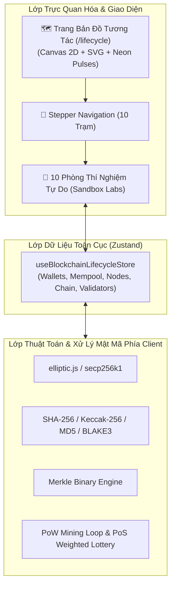

# 🚀 KẾ HOẠCH TRIỂN KHAI VÀ THEO DÕI TIẾN ĐỘ HUBBLOCK V2

Tài liệu này dùng để lưu trữ toàn bộ kiến trúc, chi tiết animation, danh sách các hoạt động tương tác tự do (Sandbox Controls) và theo dõi tiến độ thực hiện (Checklist) của phân hệ **Bản Đồ Tương Tác & 10 Module Vòng Đời Giao Dịch Blockchain**.

---

## 🏗️ I. TỔNG QUAN KIẾN TRÚC & CÔNG NGHỆ

---

## 🌟 II. ĐẶC TẢ ANIMATION & SANDBOX CONTROLS THEO TỪNG MODULE

| Trạm / Module | Điểm nhấn Animation (Framer Motion + Canvas/SVG) | Hoạt động Tương tác Tự do (Interactive Sandbox) |
| :--- | :--- | :--- |
| **0. Roadmap Hub** (`/lifecycle`) | Mạng lưới các trạm phát sáng Neon, xung photon di chuyển dọc đường ray nối giữa 10 trạm, hiệu ứng Depth-of-field khi di chuột. | Bản đồ metro/city thu nhỏ, click vào trạm bất kỳ để mở Modal Preview hoặc nhảy thẳng vào Lab tương ứng. |
| **1. Wallet & Faucet** (`/lifecycle/wallet`) | Hiệu ứng sinh khóa xoay tròn (Keygen Spinning), mưa đồng xu khi nhận Faucet, ẩn/hiện Private Key dạng sao lấp lánh. | - Nút **💧 Nhận 100 HUB (Faucet)**. - Thanh trượt chọn số lượng từ của Seed (12 / 24 từ). - Bảng quản lý Multi-wallet đổi Active Wallet tức thì. |
| **2. Tx & Signer** (`/lifecycle/transaction`) | Con dấu số (Digital Stamp) dập xuống khi bấm Ký số, hiệu ứng viền xanh lục khi hợp lệ, viền đỏ cảnh báo khi bị sửa đổi. | - Slider điều chỉnh **Gas Fee (1 – 100 Gwei)**. - Nút thử nghiệm **Giả mạo (Tamper Tx)** để thấy chữ ký số bị vỡ. - Input Memo/Data tùy ý. |
| **3. SHA-256 Lab** (`/lifecycle/hash`) | 64 thanh bit xoay chuyển qua 6 bước nén, thanh đo % Avalanche nhảy số real-time, tô màu khác biệt Hex. | - Thanh trượt lướt qua 6 bước nén nội bộ. - Bảng Datatable so sánh MD5, SHA-1, SHA-256, SHA-3, BLAKE3 (lọc theo tốc độ/an toàn). |
| **4. Merkle Root** (`/lifecycle/merkle`) | Cây nhị phân SVG tự vẽ các nhánh nối, xung ánh sáng chạy từ lá lên đỉnh Root khi tính toán. | - Thêm/xóa giao dịch lá tùy thích (tự động nhân bản lá nếu lẻ). - Nhấp vào 1 lá sửa chữ để xem toàn bộ nhánh cây đổi sang màu đỏ. |
| **5. Block Assembly** (`/lifecycle/block`) | Các mảnh ghép Header & Body trượt vào khớp thành một khối Block 3D hoàn chỉnh. | - Tự chọn các Tx từ Mempool gom vào Block. - Chỉnh sửa Timestamp, Version và xem Hash thay đổi. |
| **6. P2P Network** (`/lifecycle/p2p`) | Đồ thị mạng lưới Mesh 60fps, các gói tin (Data Packets) bay lượn giữa các Node, tia chớp khi ngắt kết nối. | - Slider chỉnh **Độ trễ mạng / Latency (0 – 2000ms)**. - Click vào dây nối để ngắt/bật kết nối Node. - Nút Broadcast quan sát độ lan tỏa qua từng Node. |
| **7. Mempool Queue** (`/lifecycle/mempool`) | Bảng giao dịch trôi nổi theo mức độ ưu tiên, hiệu ứng dung lượng bình chứa (Liquid Gauge). | - Nút chuyển chế độ sắp xếp: **Theo Phí Gas cao nhất** vs **FIFO**. - Chọn thủ công hoặc Auto-pick Top 5 Tx đóng Block. |
| **8. 2-Block Handshake** (`/lifecycle/handshake`) | **Tia sáng Neon cực mạnh** phóng từ Current Hash (Block 1) cắm trực tiếp vào Previous Hash (Block 2). | - Màn hình chia đôi (Split-screen). - Nút lớn bấm "Liên kết mắt xích" để kích hoạt chuỗi phản ứng băm. |
| **9. PoS Consensus** (`/lifecycle/pos`) | Vòng quay may mắn (Roulette Wheel) có trọng số Stake, hiệu ứng sấm sét khi phạt (Slashing). | - Slider phân bổ số lượng HUB Staking cho từng Validator. - Nút quay số **"Run PoS Slot"**. - Nút kích hoạt **"Slashing"** trừ 20% tiền cọc của kẻ gian. |
| **10. Tamper Detection** (`/lifecycle/tamper`) | Hiệu ứng đứt xích liên hoàn, các khối chuyển từ Xanh Lá sang Đỏ Rực rực lửa khi phát hiện gian lận. | - Click sửa dữ liệu bất kỳ trong quá khứ. - Nút **Reset Chain** hoặc **Cố tình Đào lại toàn chuỗi (Re-mine Chain)**. |

---

## 📋 III. CHECKLIST THEO DÕI TIẾN ĐỘ TRIỂN KHAI

### 🔹 GIAI ĐOẠN 1: NỀN TẢNG CỐT LÕI & BẢN ĐỒ TRỰC QUAN (PHASE 1)
- [x] **1.1. Khởi tạo Global Lifecycle Store**
  - [x] File `src/store/useBlockchainLifecycleStore.ts` (Zustand + Persist)
  - [x] State: `wallets`, `activeWalletId`, `mempool`, `nodes`, `currentDraftBlock`, `blockchain`, `validators`, `journeyStep`
  - [x] Action: Faucet, AddWallet, SignTx, AddToMempool, MineBlock, TamperBlock, ReMineChain, Slashing...
- [x] **1.2. Thiết lập Routing & Navigation**
  - [x] Layout `/src/app/lifecycle/layout.tsx`
  - [x] Thanh tiến trình 10 bước `src/components/lifecycle/LifecycleStepper.tsx` với Framer Motion sliding pill
  - [x] Thêm nút "Vòng đời (Lifecycle)" vào Navbar chính (`src/components/layout/Header.tsx`)
- [x] **1.3. Trang Bản Đồ Tương Tác Roadmap Hub**
  - [x] Route `/src/app/lifecycle/page.tsx`
  - [x] Canvas 2D + SVG trực quan hóa 10 trạm phát sáng Neon và đường ray truyền photon
  - [x] Modal xem trước nhanh (Quick Preview) và nhảy vào trạm bất kỳ

---

### 🔹 GIAI ĐOẠN 2: 5 MODULE KHỞI TẠO & MẬT MÃ HỌC (PHASE 2)
- [x] **2.1. Module 1: Wallet & Faucet** (`/lifecycle/wallet`)
  - [x] Tạo cặp khóa ECDSA `secp256k1` & Address `0x`
  - [x] Sinh / Nhập 12 từ Seed Phrase BIP-39 deterministic
  - [x] Nút Faucet cấp 100 HUB kèm animation
  - [x] Bảng Multi-wallet đổi Active Wallet tức thì
- [x] **2.2. Module 2: Transaction & Digital Signature** (`/lifecycle/transaction`)
  - [x] Form nhập From, To, Amount, Memo
  - [x] Slider chỉnh Gas Fee (1-100 Gwei)
  - [x] Nút Ký số ECDSA (tính `r, s, v`) + Con dấu số
  - [x] Nút Tamper Test thử phá hoại dữ liệu để xem lỗi xác thực chữ ký
  - [x] Nút Broadcast gửi vào Mempool
- [x] **2.3. Module 3: Deep SHA-256 Cryptography Lab** (`/lifecycle/hash`)
  - [x] Real-time hash input & stats
  - [x] Slider/Tabs 6 bước nén nội bộ (Padding, 512-bit block, W0..W63, H0..H7, 64 rounds, final addition)
  - [x] Avalanche split-screen so sánh bit flip real-time
  - [x] Datatable so sánh MD5, SHA-1, SHA-256, SHA-3, BLAKE3
- [x] **2.4. Module 4: Visual Merkle Root** (`/lifecycle/merkle`)
  - [x] Sơ đồ cây nhị phân SVG tự ghép cặp từ lá lên đỉnh
  - [x] Tự động nhân đôi lá lẻ khi số Tx lẻ
  - [x] Click sửa 1 lá để xem hiệu ứng đổi màu đỏ lan truyền lên Root
- [x] **2.5. Module 5: Block Header & Body Assembly** (`/lifecycle/block`)
  - [x] Ghép các thành phần Header (Version, PrevHash, MerkleRoot, Timestamp, Target, Nonce)
  - [x] Đính kèm Coinbase Tx và danh sách Tx được chọn
  - [x] Animation các mảnh ghép trượt vào thành khối hoàn chỉnh

---

### 🔹 GIAI ĐOẠN 3: 5 MODULE HẠ TẦNG, MẠNG LƯỚI & CHUỖI KHỐI (PHASE 3)
- [x] **3.1. Module 6: P2P Network Topology** (`/lifecycle/p2p`)
  - [x] Đồ thị Mesh Network 5-8 Node tương tác
  - [x] Chỉnh thanh trượt Latency (0-2000ms)
  - [x] Click ngắt/bật kết nối giữa các Node
  - [x] Nút Broadcast xem hiệu ứng chùm hạt packet lan truyền
- [x] **3.2. Module 7: Mempool Priority Queue** (`/lifecycle/mempool`)
  - [x] Bảng hàng đợi Tx Pending với thanh đo dung lượng Liquid Gauge
  - [x] Chuyển đổi bộ lọc: Highest Gas Fee First vs FIFO
  - [x] Chọn thủ công / Auto-pick đóng Block
- [x] **3.3. Module 8: Interactive 2-Block Handshake** (`/lifecycle/handshake`)
  - [x] Giao diện Split-screen: Block 1 (Locked) vs Block 2 (Pending)
  - [x] Nút "Liên kết mắt xích" phóng tia sáng Neon cắm PrevHash
  - [x] Tự động tính toán lại Hash Block 2 và chuyển viền xanh lá
- [x] **3.4. Module 9: Proof of Stake Consensus** (`/lifecycle/pos`)
  - [x] Bảng Validator kèm slider phân bổ Stake và biểu đồ Donut
  - [x] Vòng quay may mắn (Roulette) có trọng số chọn Block Proposer
  - [x] Thưởng Staking Reward & Nút kích hoạt Slashing (tước quyền + trừ 20% Stake)
- [x] **3.5. Module 10: Tamper Detection & Re-mining** (`/lifecycle/tamper`)
  - [x] Chuỗi 3-5 khối hợp lệ
  - [x] Click sửa dữ liệu bất kỳ trong quá khứ -> Kích hoạt đứt xích và đánh đỏ toàn chuỗi
  - [x] Nút Reset Chain đưa về ban đầu
  - [x] Nút "Re-mine Chain" tính toán lại từng khối đến cuối chuỗi
- [x] **3.6. Hoàn Thiện Tích Hợp & Đánh Giá**
  - [x] Cập nhật i18n Từ điển VI/EN cho toàn bộ 10 module mới
  - [x] Tương thích 100% Dark / Light Mode và Canvas Background
