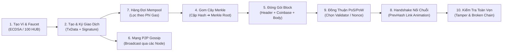

# KẾ HOẠCH CẬP NHẬT TRANG WEB MÔ PHỎNG BLOCKCHAIN PHỤC VỤ MỤC ĐÍCH HỌC TẬP (HUBBLOCK V2)

---

## I. MỤC TIÊU DỰ ÁN & ĐỊNH HƯỚNG NÂNG CẤP

1. **Mục tiêu chung**: Xây dựng và nâng cấp hệ thống mô phỏng Blockchain trực quan, tương tác cao nhằm phục vụ công tác giảng dạy, nghiên cứu và học tập các nguyên lý cốt lõi của công nghệ Blockchain cho sinh viên, giảng viên và người mới bắt đầu.
2. **Trực quan hóa thuật toán mật mã học Web3**: Minh họa sinh động các cơ chế mật mã phức tạp như hàm băm SHA-256 (với 6 bước nén nội bộ), cây Merkle (nhị phân), chữ ký số ECDSA (secp256k1), rút gọn địa chỉ Keccak-256 (chuẩn Ethereum/EVN), và cấu trúc mắt xích chuỗi khối.
3. **Mô phỏng vòng đời giao dịch khép kín (End-to-End Lifecycle)**: Tạo môi trường tương tác 10 bước liền mạch cho phép người dùng thực hành: Tạo ví ➔ Cấp tiền Faucet ➔ Khởi tạo & Ký số giao dịch ➔ Đẩy vào Mempool ➔ Truyền tải qua Mạng P2P ➔ Gom cây Merkle ➔ Đóng gói Block ➔ Cơ chế đồng thuận PoS / PoW ➔ Liên kết mắt xích Handshake ➔ Kiểm tra phát hiện gian lận (Tamper Detection).
4. **Hai chế độ trải nghiệm linh hoạt (Dual Mode Experience)**:
   - **Chế độ Kịch bản (Guided Journey / Tour)**: Dữ liệu tự động truyền tiếp qua State Management toàn cục (`useBlockchainLifecycleStore`) từ Bước 1 đến Bước 10.
   - **Chế độ Thử nghiệm Tự do (Interactive Sandbox)**: Từng module có nút *"Nạp Dữ liệu Mẫu (Quick Demo)"* cho phép sinh viên thực hành độc lập bất kỳ khái niệm nào mà không phụ thuộc vào các bước trước.
5. **Kế thừa & Tích hợp hoàn hảo với hệ thống hiện hữu**: Giữ vững các nền tảng vững chắc của V1 (Hệ thống Quiz 40 câu có tính giờ, Ôn tập câu sai Spaced Repetition, Trình bóc tách đề thi Mistral AI, Module Toán học RSA, Canvas Background, Đa ngôn ngữ VI/EN, Dark/Light mode).

---

## II. DANH SÁCH CHI TIẾT 10 MODULE MÔ PHỎNG VÒNG ĐỜI GIAO DỊCH

---

### 1. Module Ví điện tử & Quản lý ví (Wallet Creation & Management)

#### a. Giao diện mô phỏng:
- **Khu vực Giới thiệu (Tĩnh)**:
  - **Tiêu đề**: Wallet (Ví điện tử)
  - **Phụ đề**: Nơi lưu giữ cặp khóa và danh tính mật mã của người dùng trên Blockchain.
  - **Mô tả**: Một ví Blockchain không lưu trữ "tiền" theo nghĩa vật lý, mà lưu trữ một cặp khóa (**Private Key** và **Public Key**) được sinh ra bằng thuật toán mã hóa bất đối xứng (**ECDSA — Elliptic Curve Digital Signature Algorithm, đường cong `secp256k1`**, cùng chuẩn với Bitcoin/Ethereum). Từ Public Key, hệ thống rút gọn qua hàm băm Keccak-256 để tạo ra **Địa chỉ ví (Address `0x...`)**.
  - **Thẻ thông tin (Badges)**: `Thuật toán: ECDSA (secp256k1)` | `Độ dài Private Key: 256-bit (64 hex)` | `Public Key: 512-bit (uncompressed)` | `Định dạng Address: 0x + 40 hex chars`.

- **Khu vực Tương tác (Động)**:
  - **Hành động 1 (Khởi tạo ngẫu nhiên)**: Nút **"Tạo Ví Mới"** — sinh ngẫu nhiên cặp Private/Public Key và Address tức thì phía client.
  - **Hành động 2 (Seed Phrase / Mnemonic Deterministc)**: Khung nhập **"SEED PHRASE (BIP-39 / Tùy chọn)"**. Có nút *"Sinh 12 từ ngẫu nhiên"* hoặc tự gõ chuỗi Seed. Nút *"Tạo ví từ Seed"* để chứng minh tính xác định (Deterministic): cùng một Seed luôn tái tạo ra cùng một Private Key.
  - **Hành động 3 (Bảo mật hiển thị)**: Ô Private Key mặc định bị che `••••••••`, có nút icon Mắt (Hiện/Ẩn), nút Copy nhanh, kèm cảnh báo đỏ: *"Không bao giờ chia sẻ Private Key"*.
  - **Hành động 4 (Cấp tiền thử nghiệm — Testnet Faucet / Airdrop)**: Nút **"💧 Nhận 100 HUB (Faucet)"** — cấp ngay 100 HUB token vào ví đang chọn để phục vụ thực hành gửi nhận ở các bước sau.
  - **Hành động 5 (Quản lý nhiều ví - Multi-Wallet Session)**: Bảng danh sách ví đã tạo trong phiên làm việc. Cho phép đặt tên gợi nhớ (Alice, Bob, Charlie...), xem số dư HUB, chọn **Active Wallet** (Radio button) để tự động làm ví gửi ở Module Giao dịch.
  - **Hành động 6 (Import ví)**: Nhập Private Key có sẵn để khôi phục Public Key và Address tương ứng.

- **Kết quả (Đầu ra)**:
  - 3 Khung Textbox: `PRIVATE KEY (Ẩn/Hiện)`, `PUBLIC KEY`, `WALLET ADDRESS (0x...)`.
  - Bảng điều khiển realtime: Tổng số ví trong phiên, Active Wallet, Số dư (HUB), Timestamp tạo ví.

---

### 2. Module Trình mô phỏng & Ký số giao dịch (Transaction Simulator & ECDSA Signer)

#### a. Giao diện mô phỏng:
- **Khu vực Giới thiệu (Tĩnh)**:
  - **Tiêu đề**: Transaction & Digital Signature (Giao dịch & Ký số)
  - **Phụ đề**: Đơn vị chuyển giao giá trị và cơ chế bảo đảm tính toàn vẹn, bất khả chối cãi bằng chữ ký số.
  - **Mô tả**: Giao dịch Blockchain ghi lại: Người gửi (`From`), Người nhận (`To`), Số lượng (`Amount`), Phí gas (`Gas Fee`), Số thứ tự (`Nonce`), và Dữ liệu (`Data`). Để hợp lệ, giao dịch **bắt buộc phải được ký bằng Private Key của người gửi** thông qua thuật toán ECDSA. Chữ ký này cho phép bất kỳ ai dùng Public Key của người gửi để xác minh giao dịch mà không cần biết Private Key.
  - **Thẻ thông tin**: `Cấu trúc: JSON` | `Băm TxID: SHA-256` | `Thuật toán ký: ECDSA secp256k1` | `Trạng thái: Draft ➔ Signed ➔ Pending`.

- **Khu vực Tương tác (Động)**:
  - **Hành động 1 (Chọn người gửi)**: Dropdown `FROM` — tự động lấy từ danh sách ví ở Module 1, hiển thị số dư hiện có. Mặc định là Active Wallet.
  - **Hành động 2 (Chọn người nhận)**: Dropdown `TO` — chọn ví khác trong danh sách hoặc bấm *"Nhập địa chỉ 0x tùy ý"*.
  - **Hành động 3 (Nhập số tiền & Phí Gas)**: Ô nhập `AMOUNT (HUB)` (có kiểm tra không vượt quá số dư ví) + Slider `GAS FEE (Gwei/HUB)` (minh họa phí cao/thấp).
  - **Hành động 4 (Ghi chú Data/Memo)**: Ô nhập chuỗi văn bản hoặc Hex data đính kèm.
  - **Hành động 5 (Tạo & Ký số - Sign Transaction)**:
    - Nút **"1. Ký Giao Dịch (Sign with Private Key)"**: Hệ thống băm gói dữ liệu thành `TxHash`, dùng Private Key của ví gửi sinh ra Chữ ký số `Signature (r, s, v)`.
    - Thẻ trạng thái chuyển sang **"Đã ký hợp lệ ✅"**.
  - **Hành động 6 (Thử nghiệm Giả mạo chữ ký - Tamper Test)**: Cho phép sửa thử số tiền hoặc người nhận sau khi đã ký ➔ Hệ thống lập tức báo lỗi đỏ: *"Chữ ký không khớp với dữ liệu giao dịch! (Signature Verification Failed)"*.
  - **Hành động 7 (Phát tán)**: Nút **"2. Gửi vào Mempool (Broadcast)"** — đẩy giao dịch hợp lệ vào hàng đợi Mempool và mạng P2P.

- **Kết quả (Đầu ra)**:
  - Khung JSON dữ liệu giao dịch đầy đủ (kèm trường `signature: { r, s, v }`).
  - Khung `TRANSACTION ID (TxID)` (chuỗi 64 ký tự Hex).
  - Huy hiệu trạng thái: `DRAFT` / `SIGNED` / `VERIFIED` / `INVALID` / `PENDING IN MEMPOOL`.

---

### 3. Module SHA-256 & Khám phá Mật mã học (Deep Cryptography Lab)

- **Sub-module 3.1: Real-time Hash Generator**:
  - Gõ văn bản thời gian thực ➔ Xuất mã băm SHA-256 64 ký tự Hex (256 bits).
  - Thống kê: Byte count đầu vào, Thời gian tính toán (ms), Phân bố ký tự Hex.
- **Sub-module 3.2: Interactive 6-Step Compression Breakdown (Mổ xẻ 6 bước nén SHA-256)**:
  - Slider/Tabs tương tác xem chi tiết cách thuật toán hoạt động:
    1. *Padding bits*: Thêm bit 1, các bit 0 và 64-bit độ dài để đạt bội số 512 bits.
    2. *Chia khối (Block Parsing)*: Tách thành các block 512-bit (16 từ 32-bit `W0..W15`).
    3. *Mở rộng lịch biểu thông điệp (Message Schedule)*: Sinh 64 từ `W0..W63` bằng các hàm `σ0`, `σ1`.
    4. *Khởi tạo giá trị băm (Initial Hash Values)*: 8 thanh ghi `H0..H7` (căn bậc hai số nguyên tố).
    5. *64 Vòng lặp nén (64 Compression Rounds)*: Phép toán bitwise hàm `Ch`, `Maj`, `Σ0`, `Σ1`.
    6. *Cộng dồn & Đầu ra cuối*: Cộng giá trị thanh ghi vào H0..H7 và ghép chuỗi kết quả 64 hex chars.
- **Sub-module 3.3: Khám phá 5 tính chất bảo mật cốt lõi**:
  - 5 thẻ tương tác: *Tính xác định (Deterministic)*, *Kháng tiền ảnh 1 (Pre-image Resistance ~2^256)*, *Kháng tiền ảnh 2 (Second Pre-image)*, *Kháng va chạm (Collision Resistance ~2^128)*, *Hiệu ứng tuyết lở (Avalanche Effect)*.
- **Sub-module 3.4: Avalanche Simulator (Mô phỏng Tuyết lở)**:
  - Màn hình chia đôi: Chuỗi A ("hello") vs Chuỗi B ("hellp").
  - So sánh trực quan từng cặp ký tự Hex, tô đỏ điểm khác biệt, đồng hồ đo `% Bits thay đổi` (nhảy real-time, mục tiêu ~50% bit flip).
- **Sub-module 3.5: Bảng so sánh thuật toán (Interactive Algorithm Matrix)**:
  - Datatable so sánh: `MD5`, `SHA-1`, `SHA-256`, `SHA-512`, `SHA-3 (Keccak)`, `BLAKE3`.
  - Bộ lọc sắp xếp theo: Tốc độ xử lý, Độ dài băm, Mức độ an toàn (Deprecated / Broken / Secure / Next-Gen).

---

### 4. Module Merkle Root (Cây Merkle & Gom Cụm Giao Dịch)

#### a. Giao diện mô phỏng:
- **Khu vực Giới thiệu**: Khái niệm cây nhị phân Merkle Tree, cơ chế gom cặp hash từ dưới lên trên (`Leaf ➔ Branch ➔ Root`) giúp xác minh sự tồn tại của giao dịch với độ phức tạp $O(\log N)$ thay vì $O(N)$ (SPV Proofs).
- **Khu vực Tương tác & Trực quan**:
  - Danh sách giao dịch lá (`Tx0, Tx1, Tx2, ...` lấy từ Mempool hoặc nhập tay).
  - Nút *"Thêm Giao dịch"* / *"Xóa"* / *"Tạo Cây Merkle"*.
  - Sơ đồ trực quan dạng đồ thị cây nhị phân (SVG / Canvas tương tác):
    - Tầng lá: `H(Tx0)`, `H(Tx1)`, `H(Tx2)`, `H(Tx3)`.
    - Tầng trung gian: `H(01) = Hash(H0 + H1)`, `H(23) = Hash(H2 + H3)`.
    - Tầng đỉnh: `Merkle Root = Hash(H01 + H23)`.
  - **Tự động cân bằng số lẻ**: Nếu số lượng giao dịch là số lẻ (ví dụ 3 Tx), hệ thống tự động nhân bản nút cuối (`Tx2` ghép với `Tx2`) theo đúng chuẩn Bitcoin Core.
  - **Thử nghiệm tính toàn vẹn**: Nhấp chuột vào bất kỳ giao dịch lá nào để chỉnh sửa 1 ký tự ➔ Toàn bộ nhánh cây dẫn lên Root lập tức đổi sang màu đỏ rực, minh họa sự lan truyền thay đổi mã băm.

---

### 5. Module Block Creation (Cấu Trúc Khối & Đóng Gói)

#### a. Giao diện mô phỏng:
- **Khu vực Block Header (Tiêu đề khối)**:
  - `Block Version`: Phiên bản phần mềm (ví dụ `0x20000000`).
  - `Previous Block Hash`: Mã băm của khối trước (liên kết mắt xích).
  - `Merkle Root`: Mã băm gốc đại diện cho toàn bộ giao dịch lấy từ Module 4.
  - `Timestamp`: Thời gian tạo khối dạng Unix timestamp.
  - `Target / Difficulty`: Độ khó khai thác.
  - `Nonce`: Số nguyên ngẫu nhiên dùng để tìm mã băm hợp lệ.
- **Khu vực Block Body (Thân khối)**:
  - `Coinbase Transaction`: Giao dịch phát hành tiền thưởng khối (Block Reward + Tổng Phí Gas) cho Thợ đào / Validator.
  - `Transactions List`: Danh sách các giao dịch được chọn từ Mempool.
- **Hành động & Đầu ra**:
  - Nút **"Đóng Gói Khối (Assemble Block Header)"** ➔ Tự động tổng hợp dữ liệu Header.
  - Khung hiển thị `BLOCK HASH = SHA-256(SHA-256(BlockHeader))`.

---

### 6. Module Network P2P (Mạng Ngang Hàng & Lan Truyền Giao Dịch)

#### a. Giao diện mô phỏng:
- **Sơ đồ Mạng lưới Topo (Interactive Network Graph)**:
  - Hiển thị trực quan 5–8 Node mạng (Node 1, Node 2, ..., Node N) kết nối với nhau dạng lưới Mesh.
  - Mỗi Node có trạng thái: Đang kết nối (Xanh lá), Bị ngắt kết nối (Đỏ), Đang đồng bộ (Vàng).
- **Chức năng & Tương tác**:
  - **Thêm/Ngắt kết nối Node**: Nhấp vào dây nối giữa 2 Node để cắt đứt hoặc kết nối lại.
  - **Phát tán Giao dịch (Gossip Protocol Broadcast)**: Chọn 1 Node nguồn ➔ Bấm *"Broadcast Transaction"* ➔ Chùm tia sáng dữ liệu (Packet Animation) di chuyển từ Node nguồn lan truyền sang các Node lân cận.
  - **Mô phỏng Độ trễ Mạng (Network Latency & Propagation Delay)**: Thanh trượt chỉnh Ping (0ms – 2000ms), quan sát thời gian các Node nhận được giao dịch khác nhau.
  - **Kiểm tra trùng lặp (Deduplication)**: Node khi nhận gói tin đã có trong bộ nhớ sẽ không phát tán lại, tránh bão lặp mạng (Broadcast storm).

---

### 7. Module Mempool (Hàng Đợi Giao Dịch & Ưu Tiên Phí Gas)

#### a. Giao diện mô phỏng:
- **Khu vực Bảng Hàng đợi Mempool**:
  - Bảng danh sách các giao dịch đang ở trạng thái `Pending`.
  - Cột: `TxID`, `Người gửi (From)`, `Người nhận (To)`, `Số lượng (Amount)`, `Phí Gas (Gas Fee)`, `Kích thước (Bytes)`, `Thời gian vào (Timestamp)`.
- **Chức năng & Tương tác**:
  - **Cơ chế sắp xếp ưu tiên (Priority Sorting)**: Nút chuyển đổi chế độ lọc:
    - *Theo Phí Gas cao nhất (Highest Gas First)* (mô phỏng chuẩn Miner/Validator kinh tế).
    - *Theo thời gian đến trước (FIFO - First In First Out)*.
  - **Thanh đo Dung lượng Mempool (Mempool Capacity Gauge)**: Thể hiện % dung lượng đã chiếm dụng.
  - **Chọn giao dịch đóng Block**: Nút *"Tự động chọn Top 5 Tx phí cao nhất"* hoặc tích chọn thủ công đưa vào Block tiếp theo.
  - **Xóa & Xác nhận**: Khi Block được tạo và chấp thuận, các Tx tương ứng lập tức được xóa khỏi Mempool và chuyển sang trạng thái `Confirmed`.

---

### 8. Module Liên Kết Khối (Interactive 2-Block Handshake)

#### a. Giao diện mô phỏng (Split-Screen View):
- **Card Khối Nguồn (Bên trái - Block #1 - Genesis/Previous)**:
  - Khung màu Xanh Dương Neon.
  - Thông tin: `Block #1`, `Nonce: 19482`, `Data: "Alice ➔ Bob 10 HUB"`.
  - `Current Hash`: `0000a3f7c9...` (Có icon 🔒 Đã khóa).
- **Card Khối Đích (Bên phải - Block #2 - Candidate Block)**:
  - Khung màu Cam Cảnh báo.
  - Thông tin: `Block #2`, `Data: "Bob ➔ Charlie 5 HUB"`.
  - Ô `Previous Hash`: Viền đứt nét đỏ `[ Đang chờ liên kết ? ]`.
  - Ô `Block Hash`: Báo xám `[ Chưa thể băm khi thiếu Previous Hash ]`.
- **Nút Hành Động Trung Tâm & Hiệu ứng UX**:
  - Nút bấm lớn phát sáng: **"🔗 Tạo Mắt Xích Liên Kết (Link Blocks)"**.
  - **Animation Luồng Ánh Sáng Neon**: Khi bấm nút, một chùm hạt Photon di chuyển từ ô `Current Hash` (Block 1) cắm thẳng vào ô `Previous Hash` (Block 2).
  - Ô `Previous Hash` Block 2 nhận giá trị, chuyển sang viền Xanh Lá. Khối Block 2 lập tức kích hoạt tính toán lại Hash và hoàn tất chuỗi liên kết.

---

### 9. Module Proof of Stake (Đồng Thuận Bằng Chứng Cổ Phần)

#### a. Giao diện mô phỏng:
- **Khu vực Quản lý Validator & Lượng Cổ phần (Stake Pool)**:
  - Danh sách 4–6 Validator (ví dụ: Node Alice: 500 HUB (50%), Node Bob: 300 HUB (30%), Node Charlie: 200 HUB (20%)).
  - Biểu đồ tròn (Donut Chart) trực quan hóa tỷ lệ phần trăm Stake của từng Node trong mạng lưới.
  - Cho phép thêm Validator mới hoặc điều chỉnh số lượng HUB đặt cọc (Staking Slider).
- **Chức năng Thuật toán & Mô phỏng**:
  - **Vòng quay May mắn có trọng số (Weighted Random Selection)**:
    - Thuật toán mô phỏng lựa chọn Slot Leader / Block Proposer dựa trên trọng số Stake.
    - Animation vòng quay hoặc xúc xắc xác suất ngẫu nhiên dừng lại ở Validator chiến thắng.
  - **Đúc khối & Trả thưởng (Minting & Staking Reward)**:
    - Validator được chọn sẽ ký và phát hành Block mới, nhận tiền thưởng khối (Block Reward) cộng vào tổng tài sản Stake.
  - **Mô phỏng Phạt Vi Phạm (Slashing Mechanism)**:
    - Tùy chọn *"Kích hoạt gian lận (Double Signing)"* cho 1 Validator ➔ Hệ thống kích hoạt cơ chế Slashing: Tịch thu 20% lượng Stake và tước quyền Validator (Jailed/Inactive).

---

### 10. Module Tamper Detection (Phát Hiện Gian Lận & Toàn Vẹn Chuỗi)

#### a. Giao diện mô phỏng:
- **Chuỗi 3–5 Khối Liên Tiếp Đang Hợp Lệ (Valid Chain - Màu Xanh Lá)**:
  - Mỗi khối hiển thị: Số Block, Data, PrevHash, Hash.
- **Chức năng & Tương tác Phá Hoại**:
  - **Chỉnh sửa dữ liệu quá khứ (Tamper Data)**: Cho phép người dùng bấm vào Block #1 và sửa lại dữ liệu (ví dụ: sửa từ `"Alice chuyển Bob 10 HUB"` thành `"Alice chuyển Bob 100 HUB"`).
  - **Hiệu ứng Đứt Gãy Dây Chuyền (Chain Broken Animation)**:
    - Ngay khi sửa, Hash của Block #1 bị thay đổi.
    - Ô `PrevHash` của Block #2 không còn khớp với Hash mới của Block #1.
    - Toàn bộ các khối từ Block #1, Block #2, Block #3... lập tức **bị đổi sang màu Đỏ Rực (Status: INVALID / TAMPERED)** và các sợi dây xích liên kết giữa chúng bị đứt gãy.
  - **2 Hành động Khôi phục**:
    - **Nút 1: "Khôi Phục Trạng Thái (Reset Chain)"**: Đưa dữ liệu về ban đầu, chuỗi xanh trở lại.
    - **Nút 2: "Cố Tình Đào / Xác Thực Lại Toàn Chuỗi (Re-mine / Re-calculate Chain)"**: Bắt đầu tính toán lại Nonce/Hash cho từng khối từ vị trí bị sửa đến cuối chuỗi, minh họa chi phí tính toán khổng lồ (51% Attack / Heavy Proof-of-Work) khi muốn làm giả dữ liệu trong lịch sử.

---

## III. QUY TRÌNH KẾT HỢP LUỒNG DỮ LIỆU TỔNG THỂ (WORKFLOW LIFECYCLE)

---

## IV. ĐẶC TẢ KỸ THUẬT & KIẾN TRÚC HỆ THỐNG (ENGINEERING SPECS)

### 1. Quản lý Trạng Thái Toàn Cục (Global State Store)
Tạo Zustand Store duy nhất: `useBlockchainLifecycleStore.ts` lưu trữ:
- `wallets: Wallet[]`: Danh sách ví, PrivateKey, PublicKey, Address, Balance.
- `activeWalletId: string`: ID ví đang thao tác.
- `mempool: Transaction[]`: Hàng đợi giao dịch chờ xử lý.
- `nodes: NetworkNode[]`: Danh sách node và đồ thị liên kết P2P.
- `currentDraftBlock: Block`: Khối đang được đóng gói.
- `blockchain: Block[]`: Mảng danh sách các khối trong chuỗi (kèm trạng thái hợp lệ `isValid`).
- `validators: Validator[]`: Danh sách Validator và số lượng Stake.
- `journeyStep: number`: Bước hiện tại (1–10) trong Chế độ Kịch bản.

### 2. Cấu Trúc Routing & Sub-Navigation
- Đường dẫn cơ sở: `/lifecycle/...`
  - `/lifecycle/wallet`: Module 1
  - `/lifecycle/transaction`: Module 2
  - `/lifecycle/hash`: Module 3
  - `/lifecycle/merkle`: Module 4
  - `/lifecycle/block`: Module 5
  - `/lifecycle/p2p`: Module 6
  - `/lifecycle/mempool`: Module 7
  - `/lifecycle/handshake`: Module 8
  - `/lifecycle/pos`: Module 9
  - `/lifecycle/tamper`: Module 10
- **Giao diện Stepper Bar**: Đặt thanh tiến trình 10 bước trượt mượt mà (Framer Motion Pill) ở đầu các trang `/lifecycle/*`, cho phép người học bấm nhảy cóc hoặc đi tuần tự `Next ➔`.

### 3. Tích Hợp Hệ Thống Đánh Giá & AI Hiện Có
- **Ngân hàng câu hỏi (Quiz Hub)**: Bổ sung 30 câu hỏi trắc nghiệm mới chia thành 3 chủ đề: *Mật mã ví & Ký số ECDSA*, *Mạng P2P & Mempool*, *Đồng thuận PoS & Bảo mật chuỗi*.
- **Trình bóc tách Mistral AI (`/api/admin/ai-parse`)**: Cập nhật system prompt để AI nhận diện tốt hơn các thuật ngữ mới (ECDSA, secp256k1, Slashing, Handshake, Mempool Priority).
- **Hỗ trợ giao diện toàn diện**: 100% các màn hình mới đều tương thích hoàn hảo với **Dark / Light Mode**, **Đa ngôn ngữ Tiếng Việt / Tiếng Anh**, và **Canvas Dynamic Nodes Background**.